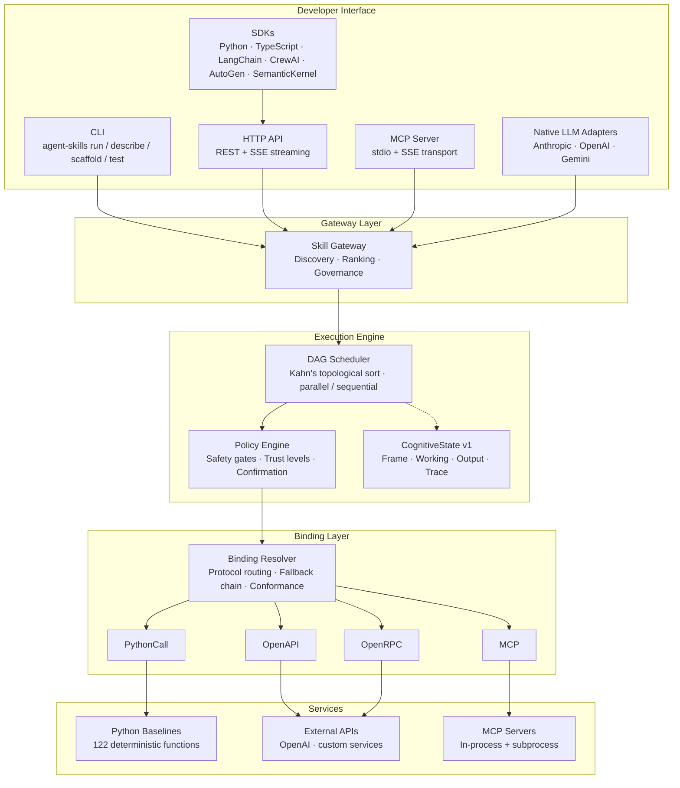
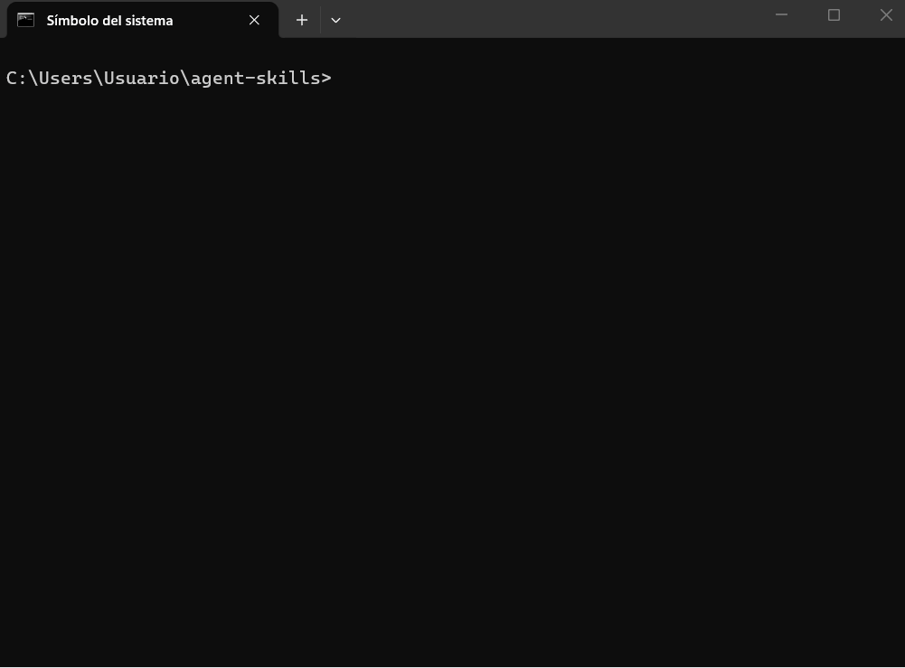

# Agent Skills Runtime

[](https://pypi.org/project/agent-skills/)
[](LICENSE)
[](https://github.com/gfernandf/agent-skills/actions/workflows/ci.yml)
[](https://www.python.org/)
[]()
[]()
[]()

**A deterministic, binding-driven execution engine for composable AI agent skills.**

Agent Skills Runtime lets you define agent capabilities as abstract contracts, wire them to any backend (Python, OpenAPI, MCP, OpenRPC), and execute multi-step workflows as declarative DAGs — with built-in safety gates, cognitive state tracking, and full observability.

> **No API keys required.** 122 capabilities ship with deterministic Python baselines.
> Install, run your first skill in under 3 minutes.

---

## 🧩 Mental Model

Think of Agent Skills as:

- **APIs** → turned into reusable “capabilities”  
- **Workflows (Zapier / Airflow)** → turned into “skills”  
- **Agent reasoning** → made explicit via structured state  

In short:

> Agent Skills lets agents execute **structured workflows over tools**, instead of guessing what to do via prompts.

---

## Table of Contents

- [Mental Model](#-mental-model)
- [Introducing ORCA](#-introducing-orca)
- [Why Agent Skills?](#why-agent-skills)
- [When should you use Agent Skills?](#-when-should-you-use-agent-skills)
- [Architecture](#architecture)
- [How it compares](#how-it-compares)
- [Quick Start](#quick-start)
  - [Install from PyPI](#install-from-pypi)
  - [Install from source](#install-from-source)
  - [Run your first skill](#run-your-first-skill)
  - [Integration modes](#choosing-your-integration-mode)
- [Advanced Features](#advanced-features)
- [Documentation](#documentation)
- [Contributing](#contributing)
- [License](#license)
- [Citing](#citing)

---

## 🧠 Introducing ORCA

**Agent Skills Runtime is a reference implementation of ORCA — an emerging standard for structured agent execution.**

> ORCA (Open Cognitive Runtime Architecture) defines a **Cognitive Execution Layer** where agents do not act through prompts, but through **composable, contract-driven processes**.

Unlike traditional agent frameworks that rely on implicit reasoning inside LLMs, ORCA externalizes cognition into:

- **Structured state (CognitiveState)** — explicit, inspectable reasoning  
- **Capabilities (contracts)** — reusable, binding-agnostic operations  
- **Skills (execution graphs)** — deterministic, composable workflows  
- **Built-in safety** — enforced execution constraints and validation  

This shifts agent systems from:

- prompt-driven behavior  
→ to  
- **execution-driven systems**

---

### 🔹 Core Principles of ORCA

- **Execution over prompting**  
- **Explicit state over implicit context**  
- **Contracts over conventions**  
- **Separation of intent and execution**  
- **Safety as a first-class concern**

---

### 🔹 Learn more

See the full ORCA specification:  
👉 [`ORCA.md`](ORCA.md)

---

## Why Agent Skills?

| Problem | How Agent Skills solves it |
|---------|--------------------------|
| Tools are coupled to one framework | **Binding abstraction** — same capability, 4 protocols (PythonCall, OpenAPI, MCP, OpenRPC) |
| Workflows are imperative code | **Declarative YAML skills** — steps, dependencies, mappings resolved by the runtime |
| No safety model | **4-tier safety gates** — trust levels, confirmation prompts, scope constraints, side-effect tracking |
| No structured reasoning state | **CognitiveState v1** — typed Frame/Working/Output/Trace aligned with CoALA |
| Inconsistent naming | **Controlled vocabulary** — 122 capabilities across 27 domains with governed naming |
| Hard to observe | **OTel + metrics + audit** — hash-chain audit trail, Prometheus metrics, SSE streaming |

---

## 🤔 When should you use Agent Skills?

Use it if you need:

- Deterministic and reproducible agent behavior  
- Safe interaction with real systems (APIs, databases, etc.)  
- Reusable workflows instead of prompt engineering  
- Observability and auditability of agent execution  

Avoid it if:

- You just need a quick prompt-based prototype  
- You don’t need control over execution or safety  

---

## Architecture

> **Note:** The diagram below uses [Mermaid](https://mermaid.js.org/). It renders natively on GitHub. If viewing on PyPI or another platform, see the [architecture diagram on GitHub](https://github.com/gfernandf/agent-skills#architecture).



---

## How it compares

| Dimension | Agent Skills | LangGraph | SemanticKernel | OpenAI SDK | CrewAI |
|-----------|:-----:|:-----:|:-----:|:-----:|:-----:|
| **DAG Execution** | ✅ Kahn sort | ✅ StateGraph | ⚠️ Linear | ⚠️ Tool-loop | ⚠️ Sequential |
| **Multi-Protocol Bindings** | ✅ 4 protocols | ❌ Python only | ⚠️ HTTP+plugins | ❌ Function only | ❌ Function only |
| **Safety Model** | ✅ 4-tier gates | ❌ None | ⚠️ Basic | ❌ Minimal | ❌ None |
| **Cognitive State** | ✅ Typed (CoALA) | ❌ No formal | ❌ No formal | ❌ No formal | ⚠️ Roles |
| **Capability Registry** | ✅ 122 governed | ❌ None | ⚠️ Plugin store | ❌ None | ⚠️ Templates |
| **Observability** | ✅ OTel+Metrics+Audit | ✅ LangSmith | ⚠️ AppInsights | ⚠️ Log-only | ⚠️ Basic |
| **Zero-config local run** | ✅ Python baselines | ⚠️ Needs LLM key | ⚠️ Needs Azure | ❌ Needs API key | ⚠️ Needs LLM key |
| **Declarative workflows** | ✅ YAML skills | ⚠️ Python code | ⚠️ C# code | ❌ Imperative | ⚠️ Python code |
| **Checkpoint/Restore** | ✅ Full state | ✅ Checkpoints | ✅ State | ❌ Stateless | ⚠️ Memory |

---

## Quick Start

### Install from PyPI

```bash
pip install agent-skills          # core
pip install agent-skills[all]     # + PDF, web, OTel extras
pip install agent-skills[mcp]     # + MCP server/client
pip install agent-skills[dev]     # + pytest, ruff, benchmarks
```

The PyPI package includes the execution engine and CLI. You'll also need the companion **[agent-skill-registry](https://github.com/gfernandf/agent-skill-registry)** (capability contracts, skills, vocabulary):

```bash
git clone https://github.com/gfernandf/agent-skill-registry.git
agent-skills doctor   # verifies registry is found
```

### Install from source

```bash
git clone https://github.com/gfernandf/agent-skills.git
cd agent-skills
make bootstrap       # clones registry alongside, installs deps
agent-skills doctor   # all checks should pass
```

> **What `make bootstrap` does:** clones the registry into `../agent-skill-registry/`, then runs `pip install -e ".[all,dev]"`. If you prefer manual setup, see [docs/INSTALLATION.md](docs/INSTALLATION.md).

### Run your first skill

<p align="center">
  
</p>

```bash
agent-skills run text.summarize-plain-input \
  --input '{"text": "Agent Skills Runtime is a deterministic execution engine for composable AI agent skills. It supports four binding protocols and ships with 122 Python baselines.", "max_length": 50}'
```

Expected output:
```json
{
  "summary": "Agent Skills Runtime is a deterministic execution engine...",
  "sentiment": "positive"
}
```

### Run via HTTP

```bash
agent-skills serve                     # starts server on :8080
curl http://localhost:8080/v1/health   # health check
curl -X POST http://localhost:8080/v1/skills/text.summarize-plain-input/execute \
  -H "Content-Type: application/json" \
  -d '{"inputs": {"text": "Hello world", "max_length": 20}}'
```

### Baseline → LLM: same skill, two modes

Every capability ships with a deterministic Python baseline. Set `OPENAI_API_KEY` to upgrade to LLM-powered execution — **zero code changes**.

```bash
# 1. Baseline mode (no API key, pure Python)
agent-skills run text.summarize-plain-input \
  --input '{"text": "Agent Skills decouples capability contracts from execution backends.", "max_length": 30}'
# → {"summary": "Agent Skills decouples capability contracts from exec..."}

# 2. LLM mode (set key, same command)
export OPENAI_API_KEY=sk-...
agent-skills run text.summarize-plain-input \
  --input '{"text": "Agent Skills decouples capability contracts from execution backends.", "max_length": 30}'
# → {"summary": "Agent Skills separates capability definitions from their runtime implementations."}
```

The binding resolver picks the best available backend automatically:
- **No key** → `PythonCall` baseline (deterministic, offline, fast)
- **Key set** → `OpenAPI` binding to OpenAI (richer output, higher latency)

This means your CI stays green without API keys, and production gets LLM quality — from the same skill YAML.

See [docs/INSTALLATION.md](docs/INSTALLATION.md) for full setup instructions, optional extras, and environment variable reference.

### Use with LangChain / LangGraph

```python
from sdk.embedded import as_langchain_tools

# No server needed — runs in-process
tools = as_langchain_tools(["text.content.summarize", "text.content.translate"])
# Pass tools to any LangChain AgentExecutor or LangGraph node
agent = create_react_agent(llm, tools)
```

Adapters are also available for **CrewAI**, **AutoGen**, and **Semantic Kernel** — see the [sdk/](sdk/) directory.

### Use as MCP Server

Expose all 122 capabilities as MCP tools over stdio (or SSE) — any MCP-compatible host (Claude Desktop, VS Code Copilot, etc.) can discover and call them:

```bash
# stdio transport (default — for Claude Desktop / MCP hosts)
python -m official_mcp_servers

# SSE transport (for network clients)
python -m official_mcp_servers --sse --host 0.0.0.0 --port 8765

# Or via the CLI
agent-skills mcp-serve
agent-skills mcp-serve --sse --port 8765
```

Requires the `mcp` extra: `pip install -e ".[mcp]"`

### Native LLM Tool Definitions

Generate provider-native tool arrays for Anthropic, OpenAI, and Gemini — no HTTP server, no adapters, just the format each SDK expects:

```python
from sdk.embedded import (
    as_anthropic_tools, execute_anthropic_tool_call,
    as_openai_tools,    execute_openai_tool_call,
    as_gemini_tools,    execute_gemini_tool_call,
)

# ── Anthropic ──────────────────────────────────
tools = as_anthropic_tools(["text.content.summarize"])
response = client.messages.create(model="claude-sonnet-4-20250514", tools=tools, ...)
result = execute_anthropic_tool_call(block.name, block.input)

# ── OpenAI ─────────────────────────────────────
tools = as_openai_tools()  # all 122 capabilities
response = openai.chat.completions.create(model="gpt-4o", tools=tools, ...)
result = execute_openai_tool_call(call.function.name, call.function.arguments)

# ── Gemini ─────────────────────────────────────
tools = as_gemini_tools(["data.schema.validate"])
response = model.generate_content(contents, tools=tools)
result = execute_gemini_tool_call(fc.name, fc.args)
```

Each `execute_*` helper maps the underscore tool name back to the dotted capability ID and returns a JSON string.

### Choosing your integration mode

| Mode | Best for | Latency | Requires server? |
|------|----------|---------|:----------------:|
| **Embedded SDK** (`sdk.embedded`) | Python apps, notebooks, scripts | Lowest (in-process) | No |
| **Native LLM tools** (`as_anthropic_tools`, etc.) | Direct Anthropic/OpenAI/Gemini integration | Low (in-process) | No |
| **LangChain / CrewAI / AutoGen** (`as_langchain_tools`, etc.) | Framework-based agents | Low (in-process) | No |
| **MCP Server** (`python -m official_mcp_servers`) | Claude Desktop, VS Code Copilot, MCP hosts | Low (stdio/SSE) | MCP host |
| **HTTP REST** (`agent-skills serve`) | Microservices, non-Python clients, multi-tenant | Medium (network) | Yes |

**Start here:** If you're writing Python, use the embedded SDK — zero setup, lowest latency. Switch to HTTP only when you need network access or non-Python clients.

## License

Apache 2.0 — see [LICENSE](LICENSE).

## Citing

If you use Agent Skills in your research, please cite:

```bibtex
@software{fernandez_agent_skills_2026,
  author       = {Fernandez Alvarez, Guillermo},
  title        = {Agent Skills Runtime},
  year         = {2026},
  url          = {https://github.com/gfernandf/agent-skills},
  version      = {0.1.0},
  license      = {Apache-2.0}
}
```

GitHub also provides a "Cite this repository" button powered by [`CITATION.cff`](CITATION.cff).

---

## Advanced Features

| Feature | Description | Docs |
|---------|-------------|------|
| **NL Autopilot** | `agent-skills ask "summarize this"` — discovers, maps, executes | [SKILL_AUTHORING.md](docs/SKILL_AUTHORING.md) |
| **Dev Watch** | Hot-reload skill development with `agent-skills dev` | [SKILL_AUTHORING.md](docs/SKILL_AUTHORING.md) |
| **Skill Triggers** | Declarative webhook / event / file-change triggers | [WEBHOOKS.md](docs/WEBHOOKS.md) |
| **Benchmark Lab** | Compare binding protocols side-by-side | CLI: `agent-skills benchmark-lab` |
| **Compose DSL** | Compact `.compose` text syntax for workflows | CLI: `agent-skills compose` |
| **Showcase** | One-command shareable markdown for any skill | CLI: `agent-skills showcase` |
| **Local Capabilities** | Custom capabilities via `.agent-skills/capabilities/` with `extends` | [SKILL_AUTHORING.md](docs/SKILL_AUTHORING.md) |
| **Auth & RBAC** | 4 hierarchical roles, API key + JWT, pluggable | [AUTH.md](docs/AUTH.md) |
| **Webhooks** | HMAC-signed event payloads with auto-retry | [WEBHOOKS.md](docs/WEBHOOKS.md) |
| **Plugin System** | Entry-point based auth, invoker, and binding-source plugins | [PLUGINS.md](docs/PLUGINS.md) |
| **Audit Trail** | Hash-chain audit with `off`/`standard`/`full` modes | [OBSERVABILITY.md](docs/OBSERVABILITY.md) |
| **CognitiveState v1** | Typed Frame/Working/Output/Trace aligned with CoALA | [COGNITIVE_STATE_V1.md](docs/COGNITIVE_STATE_V1.md) |
| **JSON Schemas** | 16 schemas (2020-12) for capabilities, skills, bindings | [JSON_SCHEMAS.md](docs/JSON_SCHEMAS.md) |
| **Governance Catalog** | Skill lifecycle: draft → validated → trusted → recommended | [SKILL_GOVERNANCE_MANIFESTO.md](docs/SKILL_GOVERNANCE_MANIFESTO.md) |
| **Binding Conformance** | `strict`/`standard`/`experimental` profiles per binding | [CONSUMER_FACING_NEUTRAL_API.md](docs/CONSUMER_FACING_NEUTRAL_API.md) |
| **Binding Fallback** | Deterministic fallback chain with terminal baseline | [RUNNER_GUIDE.md](docs/RUNNER_GUIDE.md) |

## Skill Authoring

```bash
# LLM-powered wizard — generates a complete skill from a plain-language goal
# Requires OPENAI_API_KEY (see .env.example)
export OPENAI_API_KEY=sk-...
agent-skills scaffold --wizard               # LLM proposes workflow + YAML
agent-skills scaffold "Summarize a PDF"      # one-line from intent
agent-skills scaffold --wizard --dry-run     # preview without saving

# Without OPENAI_API_KEY, the wizard falls back to manual interactive mode
# (you pick inputs, outputs, and capabilities yourself)

agent-skills test text.summarize              # auto-fixture tests
agent-skills describe text.summarize --mermaid  # DAG diagram
agent-skills export text.summarize            # portable bundle
agent-skills contribute text.summarize        # promotion pipeline
```

See [docs/SKILL_AUTHORING.md](docs/SKILL_AUTHORING.md) for the full workflow guide.

## Documentation

| Topic | Link |
|-------|------|
| 10-minute onboarding | [ONBOARDING_10_MIN.md](docs/ONBOARDING_10_MIN.md) |
| Installation & setup | [INSTALLATION.md](docs/INSTALLATION.md) |
| Environment variables | [ENVIRONMENT_VARIABLES.md](docs/ENVIRONMENT_VARIABLES.md) |
| Error taxonomy | [ERROR_TAXONOMY.md](docs/ERROR_TAXONOMY.md) |
| Runner architecture | [RUNNER_GUIDE.md](docs/RUNNER_GUIDE.md) |
| DAG scheduler | [SCHEDULER.md](docs/SCHEDULER.md) |
| Step control flow | [STEP_CONTROL_FLOW.md](docs/STEP_CONTROL_FLOW.md) |
| Streaming SSE | [STREAMING.md](docs/STREAMING.md) |
| Async execution | [ASYNC_EXECUTION.md](docs/ASYNC_EXECUTION.md) |
| Deployment & Docker | [DEPLOYMENT.md](docs/DEPLOYMENT.md) |
| Observability & OTel | [OBSERVABILITY.md](docs/OBSERVABILITY.md) |
| Authentication & RBAC | [AUTH.md](docs/AUTH.md) |
| Security | [SECURITY.md](SECURITY.md) |
| OpenAPI foundation | [OPENAPI_PHASE0_FOUNDATION.md](docs/OPENAPI_PHASE0_FOUNDATION.md) |
| MCP integration | [MCP_INTEGRATION_SLICES.md](docs/MCP_INTEGRATION_SLICES.md) |
| Governance manifesto | [SKILL_GOVERNANCE_MANIFESTO.md](docs/SKILL_GOVERNANCE_MANIFESTO.md) |
| Project status | [PROJECT_STATUS.md](docs/PROJECT_STATUS.md) |

Full documentation is served with MkDocs: `make serve` → http://localhost:8000

## Contributing

Contributions welcome! See [CONTRIBUTING.md](CONTRIBUTING.md) for guidelines.

```bash
make check   # lint + format + tests in one command
```

## Troubleshooting

| Problem | Solution |
|---------|----------|
| `RegistryNotFound` | Run `agent-skills doctor --fix` to auto-clone the registry |
| Skill returns unexpected error | See [Error Taxonomy](docs/ERROR_TAXONOMY.md) for frozen error codes |
| Environment config issues | Check [Environment Variables](docs/ENVIRONMENT_VARIABLES.md) |
