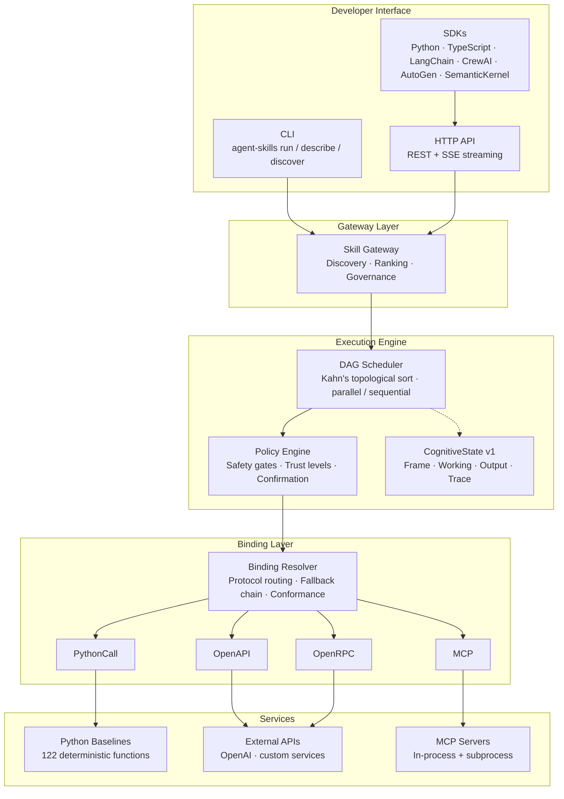

# Agent Skills Runtime

[](LICENSE)
[](https://www.python.org/)
[]()
[]()
[]()

**A deterministic, binding-driven execution engine for composable AI agent skills.**

Agent Skills Runtime lets you define agent capabilities as abstract contracts, wire them to any backend (Python, OpenAPI, MCP, OpenRPC), and execute multi-step workflows as declarative DAGs — with built-in safety gates, cognitive state tracking, and full observability.

> **No API keys required.** 122 capabilities ship with deterministic Python baselines.
> Clone, install, run your first skill in under 3 minutes.

---

## Why Agent Skills?

| Problem | How Agent Skills solves it |
|---------|--------------------------|
| Tools are coupled to one framework | **Binding abstraction** — same capability, 4 protocols (PythonCall, OpenAPI, MCP, OpenRPC) |
| Workflows are imperative code | **Declarative YAML skills** — steps, dependencies, mappings resolved by the runtime |
| No safety model | **4-tier safety gates** — trust levels, confirmation prompts, scope constraints, side-effect tracking |
| No structured reasoning state | **CognitiveState v1** — typed Frame/Working/Output/Trace aligned with CoALA |
| Inconsistent naming | **Controlled vocabulary** — 122 capabilities across 27 domains with governed naming |
| Hard to observe | **OTel + metrics + audit** — hash-chain audit trail, Prometheus metrics, SSE streaming |

---

## Architecture



---

## How it compares

| Dimension | Agent Skills | LangGraph | SemanticKernel | OpenAI SDK | CrewAI |
|-----------|:-----:|:-----:|:-----:|:-----:|:-----:|
| **DAG Execution** | ✅ Kahn sort | ✅ StateGraph | ⚠️ Linear | ⚠️ Tool-loop | ⚠️ Sequential |
| **Multi-Protocol Bindings** | ✅ 4 protocols | ❌ Python only | ⚠️ HTTP+plugins | ❌ Function only | ❌ Function only |
| **Safety Model** | ✅ 4-tier gates | ❌ None | ⚠️ Basic | ❌ Minimal | ❌ None |
| **Cognitive State** | ✅ Typed (CoALA) | ❌ No formal | ❌ No formal | ❌ No formal | ⚠️ Roles |
| **Capability Registry** | ✅ 122 governed | ❌ None | ⚠️ Plugin store | ❌ None | ⚠️ Templates |
| **Observability** | ✅ OTel+Metrics+Audit | ✅ LangSmith | ⚠️ AppInsights | ⚠️ Log-only | ⚠️ Basic |
| **Zero-config local run** | ✅ Python baselines | ⚠️ Needs LLM key | ⚠️ Needs Azure | ❌ Needs API key | ⚠️ Needs LLM key |
| **Declarative workflows** | ✅ YAML skills | ⚠️ Python code | ⚠️ C# code | ❌ Imperative | ⚠️ Python code |
| **Checkpoint/Restore** | ✅ Full state | ✅ Checkpoints | ✅ State | ❌ Stateless | ⚠️ Memory |

---

## Quick Start

```bash
# Clone & install
git clone https://github.com/gfernandf/agent-skills.git
cd agent-skills
pip install -e ".[all]"

# Verify environment
agent-skills doctor
```

### Run your first skill

```bash
agent-skills run text.summarize-plain-input \
  --input '{"text": "Agent Skills Runtime is a deterministic execution engine for composable AI agent skills. It supports four binding protocols and ships with 122 Python baselines.", "max_length": 50}'
```

Expected output:
```json
{
  "status": "success",
  "outputs": {
    "summary": "Agent Skills Runtime is a deterministic execution engine for composable AI agent skills..."
  }
}
```

### Run via HTTP

```bash
agent-skills serve                     # starts server on :8080
curl http://localhost:8080/v1/health   # health check
curl -X POST http://localhost:8080/v1/skills/text.summarize-plain-input/execute \
  -H "Content-Type: application/json" \
  -d '{"inputs": {"text": "Hello world", "max_length": 20}}'
```

### Baseline → LLM: same skill, two modes

Every capability ships with a deterministic Python baseline. Set `OPENAI_API_KEY` to upgrade to LLM-powered execution — **zero code changes**.

```bash
# 1. Baseline mode (no API key, pure Python)
agent-skills run text.summarize-plain-input \
  --input '{"text": "Agent Skills decouples capability contracts from execution backends.", "max_length": 30}'
# → {"summary": "Agent Skills decouples capability contracts from exec..."}

# 2. LLM mode (set key, same command)
export OPENAI_API_KEY=sk-...
agent-skills run text.summarize-plain-input \
  --input '{"text": "Agent Skills decouples capability contracts from execution backends.", "max_length": 30}'
# → {"summary": "Agent Skills separates capability definitions from their runtime implementations."}
```

The binding resolver picks the best available backend automatically:
- **No key** → `PythonCall` baseline (deterministic, offline, fast)
- **Key set** → `OpenAPI` binding to OpenAI (richer output, higher latency)

This means your CI stays green without API keys, and production gets LLM quality — from the same skill YAML.

See [docs/INSTALLATION.md](docs/INSTALLATION.md) for full setup instructions, optional extras, and environment variable reference.

### Use with LangChain / LangGraph

```python
from sdk.langchain_adapter import build_langchain_tools

# Start the server first: agent-skills serve
tools = build_langchain_tools(
    base_url="http://localhost:8080",
    capabilities=["text.content.summarize", "text.content.translate"],
)
# Pass tools to any LangChain AgentExecutor or LangGraph node
agent = create_react_agent(llm, tools)
```

Adapters are also available for **CrewAI**, **AutoGen**, and **Semantic Kernel** — see the [sdk/](sdk/) directory.

## License

Apache 2.0 — see [LICENSE](LICENSE).

---

This repository provides the execution layer for:

- primitive **capabilities**
- composable **skills (workflows)**
- shared **vocabulary**
- machine-readable **runtime artifacts**

The registry source of truth (contracts and canonical definitions) lives in the companion repository `agent-skill-registry`.

## Runtime Quality & Observability

- Observability implementation details: `docs/OBSERVABILITY.md`
- CognitiveState v1 cognitive execution model: `docs/COGNITIVE_STATE_V1.md`
- DAG scheduler (parallel/sequential step execution): `docs/SCHEDULER.md`
- Pre-MCP/OpenAPI readiness and consistency snapshot: `docs/PRE_MCP_OPENAPI_READINESS.md`

## Authentication & RBAC

The runtime includes a pluggable authentication and role-based access control layer.

- **Roles**: `reader` → `executor` → `operator` → `admin` (hierarchical)
- **Auth methods**: API key (`X-API-Key` header) and JWT HS256 (`Authorization: Bearer <token>`)
- **Opt-in**: Set `AGENT_SKILLS_RBAC=1` to enable; without it the legacy flat API key check applies
- **Route protection**: HTTP method + path prefix → minimum required role

The JWT verifier is stdlib-only (no external dependencies).

See `docs/AUTH.md` for configuration, role mapping, and plugin extension.

## Webhooks

The runtime supports an event-driven webhook system for observability and integration.

- **Events**: `skill.execution.started`, `skill.execution.completed`, `skill.execution.failed`, `binding.resolved`, `audit.record.created`
- **CRUD**: `POST /v1/webhooks` (register), `GET /v1/webhooks` (list), `DELETE /v1/webhooks/{id}` (remove)
- **Security**: Payloads signed with HMAC-SHA256 (`X-Signature-256` header)
- **Reliability**: Automatic retries with exponential backoff

See `docs/WEBHOOKS.md` for payload format, verification examples, and limits.

## Plugin System

The runtime supports plugin discovery via Python entry points.

Three extension groups:

- `agent_skills.auth` — custom authentication providers
- `agent_skills.invoker` — custom step invokers
- `agent_skills.binding_source` — additional binding sources

Plugins are discovered at engine startup. Failures are logged as warnings but do not block initialization.

See `docs/PLUGINS.md` for registration, discovery API, and authoring guides.

## Runtime Metrics

The `/v1/metrics` endpoint exposes operational counters and histograms:

- Execution counts (total, success, failure)
- Latency histograms per capability
- Active execution gauge

Reset via `skill.metrics.reset` or `POST /v1/skills/diagnostics/reset`.

## JSON Schema Validation

15 schemas in `docs/schemas/` (JSON Schema 2020-12) cover capabilities, skills, bindings, services, and runtime artifacts.

Validation tool:

```bash
python tooling/validate_skill_schema.py examples/
python tooling/validate_skill_schema.py path/to/skill.yaml
```

See `docs/JSON_SCHEMAS.md` for the full schema inventory, regeneration, and editor integration.

## Agent Gateway Operation Model

The runtime exposes a gateway-oriented execution model for agents that need to
discover and orchestrate skills without coupling to internal binding mechanics.

### Execution Model

Steps within a skill are scheduled by a DAG-based scheduler (`runtime/scheduler.py`).
By default, steps execute sequentially (backward-compatible). Steps that declare
`config.depends_on: []` may execute in parallel. See `docs/SCHEDULER.md`.

### CognitiveState v1

`ExecutionState` now includes structured cognitive blocks for multi-step reasoning:

- **FrameState**: immutable reasoning context (goal, constraints, success_criteria)
- **WorkingState**: mutable working memory with 10 typed cognitive slots
- **OutputState**: structured result metadata (result_type, summary, status_reason)
- **TraceState**: per-step data lineage (reads/writes) and live aggregate metrics
- **extensions**: open namespace for plugins

Reference resolution supports 7 namespaces (`inputs`, `vars`, `outputs`, `frame`,
`working`, `output`, `extensions`) with path traversal through dataclass attributes,
dict keys, and list indices.

Output mapping supports 4 merge strategies (`overwrite`, `append`, `deep_merge`,
`replace`) across 5 writable namespaces.

All features are backward-compatible — existing skills are unaffected.
See `docs/COGNITIVE_STATE_V1.md` for the full reference.

### Validated Skills

- `agent.trace` v0.1.0: 3-step sidecar for incremental execution control.
- `research.synthesize` v0.2.0: 2-step fast-path research synthesis (1 LLM call).
  Resolves PDF/URL/text sources transparently via `research.source.retrieve`.

Canonical operations across CLI/HTTP/MCP:

- `skill.list`: enumerate available skills with classification filters.
- `skill.discover`: rank skills for a user intent.
- `skill.execute`: execute a selected skill directly.
- `skill.attach`: execute a skill against an existing target (`task|run|output|transcript|artifact`).
- `skill.diagnostics` / `skill.metrics.reset`: operational visibility and reset controls.

Recommended orchestration pattern for product-facing agents:

1. Discover candidate skills for the primary user objective.
2. Select primary skill using policy (not only top-1 ranking score).
3. Execute primary skill.
4. Optionally attach sidecar skills for monitoring/control/reporting.
5. Return user-facing result plus operational trace summary.

This pattern is skill-agnostic: sidecar behavior is not hard-coded to one
specific skill and applies to any skill classified as `invocation: attach|both`.

## Skill Execution Audit Layer

The runtime supports persisted execution audit records per skill run.

- Modes: `off`, `standard`, `full`
- Default mode: `standard` (configurable via `AGENT_SKILLS_AUDIT_DEFAULT_MODE`)
- Default output: `artifacts/runtime_skill_audit.jsonl`

`standard` mode stores lightweight audit metadata and payload hashes.

`full` mode additionally stores redacted payload snapshots.

Surface controls:

- CLI `run` / `trace`: `--audit-mode off|standard|full`
- HTTP `/v1/skills/{id}/execute`: body field `audit_mode`
- MCP `skill.execute`: argument `audit_mode`

User-managed deletion is available via:

- `python cli/main.py audit-purge --trace-id <trace-id>`
- `python cli/main.py audit-purge --skill-id <skill-id>`
- `python cli/main.py audit-purge --older-than-days 30`
- `python cli/main.py audit-purge --all`

## MCP Integration Slice

The runtime now includes initial MCP-backed capability slices without changing
the official default binding selection.

- `text.content.summarize`
	- Service: `services/official/text_mcp_inprocess.yaml`
	- Binding: `bindings/official/text.content.summarize/mcp_text_summarize_inprocess.yaml`
- `data.schema.validate`
	- Service: `services/official/data_mcp_inprocess.yaml`
	- Binding: `bindings/official/data.schema.validate/mcp_data_schema_validate_inprocess.yaml`
- `web.page.fetch`
	- Service: `services/official/web_mcp_inprocess.yaml`
	- Binding: `bindings/official/web.page.fetch/mcp_web_fetch_inprocess.yaml`

Verifications:

- `python tooling/verify_mcp_text_summarize.py`
- `python tooling/verify_mcp_data_web_slices.py`

This uses an in-process MCP server adapter to validate the runtime MCP path end to end
before broader external MCP service rollout.

## OpenAI Access (Local Runtime)

An experimental official OpenAPI service/binding is available for `text.content.summarize`
using OpenAI Chat Completions.

- Service: `services/official/text_openai_chat.yaml`
- Binding: `bindings/official/text.content.summarize/openapi_text_summarize_openai_chat.yaml`
- Verifier: `python tooling/verify_openai_text_summarize.py`

Credentials are resolved from the local environment at runtime:

- `OPENAI_API_KEY`

PowerShell example:

```powershell
$env:OPENAI_API_KEY = "<your-key>"
python tooling/verify_openai_text_summarize.py
```

This flow does not change official default selection yet; it validates access and
binding behavior before capability-by-capability default promotion.

## Binding Fallback Policy (Runtime)

Execution now applies a deterministic fallback chain per capability:

1. Resolved primary binding (user override or official default).
2. Optional `metadata.fallback_binding_id` chain declared by bindings.
3. Mandatory terminal fallback to the official default binding.

Verifier:

- `python tooling/verify_binding_fallback_policy.py`

## Binding Conformance Layer

Bindings may declare metadata profile:

- `conformance_profile: strict|standard|experimental`

Behavior:

- Missing profile defaults to `standard`.
- Invalid profile values are rejected at binding load time.
- Effective profile is exposed in execution metadata for tracing/explainability.
- Optional enforcement is available at execution time using required profile
	(`strict|standard|experimental`).

CLI explain surface:

- `python cli/main.py explain-capability text.content.summarize`
- `python cli/main.py explain-capability text.content.summarize --required-conformance-profile strict`

Consumer-facing explain endpoints:

- `POST /v1/capabilities/{capability_id}/explain`
- MCP tool: `capability.explain`

Verifier:

- `python tooling/verify_binding_conformance_layer.py`
- `python tooling/verify_conformance_enforcement.py`
- `python tooling/verify_binding_conformance_suite.py`

Governance discovery surfaces:

- CLI: `python cli/main.py skill-governance --min-state trusted --limit 20`
- HTTP: `GET /v1/skills/governance?min_state=trusted&limit=20`
- MCP tool: `skill.governance.list`

Usage ingestion for governance wiring:

- `python tooling/ingest_skill_usage_from_logs.py --log-file <runtime.jsonl>`

## Skill Governance Catalog (Cold Start + Field Maturity)

The runtime now supports an operational quality catalog that is separate from the
registry source definitions.

- Builder: `python tooling/build_skill_quality_catalog.py`
- Output: `artifacts/skill_quality.json`

Optional evidence inputs (if present):

- `artifacts/skill_lab_validation.json`
- `artifacts/skill_usage_30d.json`
- `artifacts/skill_feedback_30d.json`

Example templates are provided:

- `tooling/examples/skill_lab_validation.example.json`
- `tooling/examples/skill_usage_30d.example.json`
- `tooling/examples/skill_feedback_30d.example.json`

Lifecycle states:

- `draft`
- `validated`
- `lab-verified`
- `trusted`
- `recommended`

Cold-start behavior is explicit: without field usage data, skills can still be
classified using internal evidence and readiness scoring.

## Local-to-Registry Workflow (User UX)

The platform now supports a complete local-first workflow so users can iterate
privately and only request shared-registry promotion when they are ready.

1. Generate a local skill from plain language:

```powershell
python skills.py scaffold "summarize incoming support email and store summary in memory"
```

Scaffolder defaults to `binding-first` mode:

- It asks capability `agent.plan.generate` through the runtime/binding stack,
  so user binding overrides apply automatically.
- Direct OpenAI mode is optional for experimentation only:

```powershell
$env:AGENT_SKILLS_SCAFFOLDER_MODE = "direct-openai"
```

2. Prepare a promotion package:

```powershell
python skills.py package-prepare --skill-id text.summarize-incoming-support --target-channel experimental
```

Typical targets are:

- `experimental` for early shared review with light gate requirements
- `community` when the admission checklist is already complete
- `official` only for maintainer-led final promotion

3. Validate package quality and governance readiness:

```powershell
python skills.py package-validate "<package_path>" --print-pr-command
```

4. Launch a PR in one command (after validation):

```powershell
python skills.py package-pr "<package_path>"
```

`package-pr` prepares the branch and opens the PR, but it does not auto-merge,
auto-approve, or bypass channel governance.

All package workflow commands support machine-readable output for UI/backend orchestration:

- `python skills.py package-prepare ... --json`
- `python skills.py package-validate ... --json`
- `python skills.py package-pr ... --json`

## Documentation Index

- Current project closure snapshot: `docs/PROJECT_STATUS.md`
- 10-minute onboarding for new contributors: `docs/ONBOARDING_10_MIN.md`
- Runtime runner architecture and operations: `docs/RUNNER_GUIDE.md`
- Observability, tracing, and OpenTelemetry: `docs/OBSERVABILITY.md`
- **Step control flow (condition, retry, foreach, while, router, scatter)**: `docs/STEP_CONTROL_FLOW.md`
- **Streaming SSE execution**: `docs/STREAMING.md`
- **Async execution and Run ID tracking**: `docs/ASYNC_EXECUTION.md`
- **Deployment, Docker, and CLI serve**: `docs/DEPLOYMENT.md`
- Canonical registry metrics source (counts and generation): `../agent-skill-registry/docs/CANONICAL_METRICS.md`
- Pre-MCP/OpenAPI readiness baseline: `docs/PRE_MCP_OPENAPI_READINESS.md`
- OpenAPI v1 phase-0 governance and technical foundation: `docs/OPENAPI_PHASE0_FOUNDATION.md`
- OpenAPI v1 phase-1 smoke rollout plan: `docs/OPENAPI_PHASE1_SMOKE_PLAN.md`
- OpenAPI construction packages and commit strategy: `docs/OPENAPI_CONSTRUCTION_PACKAGES.md`
- Cross-repo registry pin policy (compatibility drift control): `docs/CROSS_REPO_PIN_POLICY.md`
- **OpenAPI construction guide (copy-paste templates)**: `docs/OPENAPI_CONSTRUCTION_GUIDE.md`
- **OpenAPI population checklist (gate criteria + regression tests)**: `docs/OPENAPI_POPULATION_CHECKLIST.md`
- **OpenAPI construction phase closure (Package 6 summary)**: `docs/OPENAPI_PACKAGE6_CLOSURE.md`
- OpenAPI error and security baseline: `docs/OPENAPI_ERROR_SECURITY_BASELINE.md`
- **Consumer-facing neutral API (HTTP + MCP adapters)**: `docs/CONSUMER_FACING_NEUTRAL_API.md`
- **MCP integration rollout slices and verification**: `docs/MCP_INTEGRATION_SLICES.md`
- **Skill governance manifesto (trust model + architecture changes)**: `docs/SKILL_GOVERNANCE_MANIFESTO.md`
- **Agent trace dry-run guide (cycles, baselines, npm scenarios)**: `docs/AGENT_TRACE_DRY_RUN_GUIDE.md`
- **Gateway release go/no-go checklist (product gates)**: `docs/GATEWAY_RELEASE_GO_NO_GO.md`
- **Authentication & RBAC (roles, JWT, API keys)**: `docs/AUTH.md`
- **Webhook event system**: `docs/WEBHOOKS.md`
- **Plugin system (entry points, extension groups)**: `docs/PLUGINS.md`
- **JSON Schema inventory and validation**: `docs/JSON_SCHEMAS.md`

---

# Core Concepts

The runtime executes two fundamental building blocks defined in the registry.

## Capabilities

Capabilities represent **primitive operations**.

They define a **contract** describing what an operation does, including:

- inputs
- outputs
- execution properties
- optional metadata

Examples:
