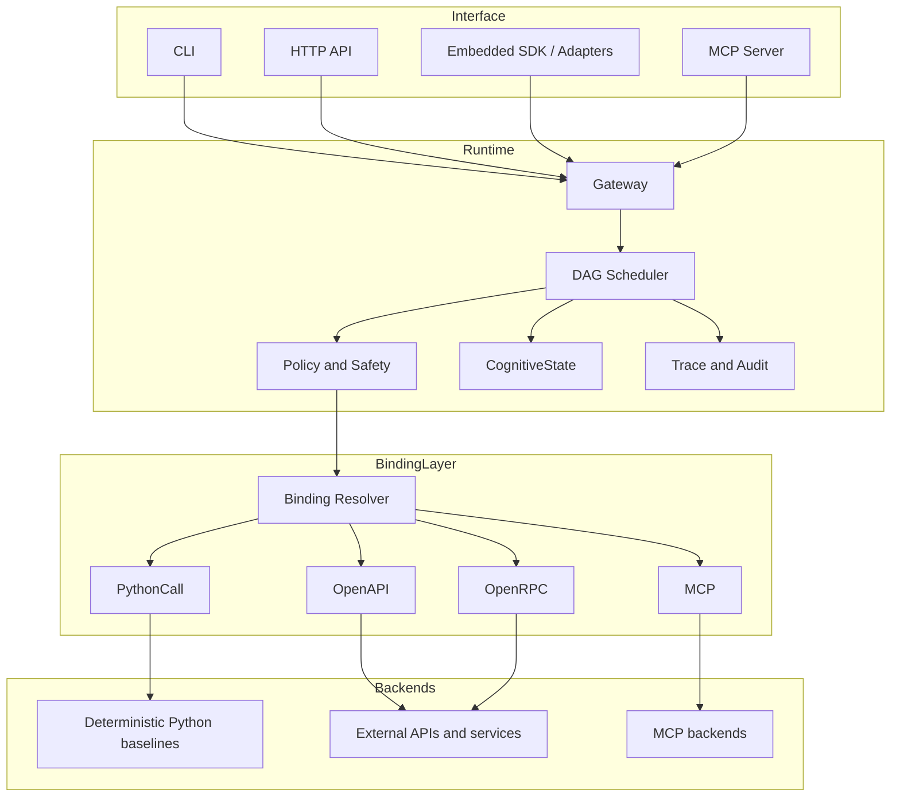

<p align="center">
  
</p>

<h1 align="center">Agent Skills Runtime</h1>

<p align="center">
  <em>Agents should execute whenever possible.</em>
</p>

<p align="center">
  <a href="https://pypi.org/project/orca-agent-skills/"></a>
  <a href="LICENSE"></a>
  <a href="https://github.com/gfernandf/agent-skills/actions/workflows/ci.yml"></a>
  <a href="https://www.python.org/"></a>
  
  
  <a href="https://doi.org/10.5281/zenodo.19438943"></a>
</p>

Agent Skills turns repeatable agent reasoning into executable skills: reusable, testable, observable, and portable across tools and model providers.

Stop rebuilding agent logic in prompts. Define it once as a skill, bind it to any backend, and run it with full traceability.

Agent Skills Runtime is the reference implementation of ORCA (Open Cognitive Runtime Architecture):

- Skills package reusable cognitive workflows
- Capabilities define backend-agnostic contracts
- Bindings connect contracts to execution backends (PythonCall, OpenAPI, MCP, OpenRPC)
- Runtime executes DAGs with policy/safety, CognitiveState, and traceability

No API key required for local-first runs. Deterministic Python baselines are available for offline development and testing.

---

## The problem

Most agent systems still encode critical logic inside prompts and framework glue.

That creates recurring engineering pain:

- Reasoning logic gets trapped in prompt text instead of executable workflows
- Workflows are hard to reuse and harder to test
- Contracts between steps are implicit and brittle
- Observability and auditability are often an afterthought
- Safety and governance controls are inconsistent
- Switching providers or frameworks usually means rewriting too much

---

## The ORCA answer

ORCA introduces an execution layer for cognitive workflows:

- Skills are reusable cognitive workflows
- Capabilities are stable, contract-driven interfaces
- Bindings are interchangeable execution backends
- Runtime is a DAG scheduler + policy engine + cognitive state + trace

This keeps reasoning structure explicit and executable, while preserving portability across backends.

---

## Before / after

Before (logic trapped in prompt text):

```python
prompt = """
Analyze this PR.
Find risks.
Estimate confidence.
Suggest fixes.
Return JSON.
"""
```

After (logic as a reusable skill graph):

```yaml
# Conceptual example (illustrative structure)
skill: code.pr.review
steps:
  - parse_diff
  - detect_risks
  - score_confidence
  - generate_review
  - validate_output
```

Same reasoning pattern. Reusable. Testable. Observable. Bindable to Python, OpenAPI, MCP, or your own APIs.

---

## Try it locally in 3 minutes

```bash
git clone https://github.com/gfernandf/agent-skills.git
cd agent-skills
make bootstrap
python skills.py doctor
python skills.py run text.language-summary \
  --input '{"text": "ORCA turns agent reasoning into reusable executable skills."}'
```

What to expect:

- No API key required
- Runs offline with deterministic Python baselines
- First run may take 30-60 seconds

<details>
<summary>Windows PowerShell setup and run</summary>

```powershell
git clone https://github.com/gfernandf/agent-skills.git
cd agent-skills
pip install -e ".[all,dev]"
git clone https://github.com/gfernandf/agent-skill-registry.git ../agent-skill-registry
python skills.py doctor

$env:OPENAI_API_KEY = ""
'{ "text": "ORCA turns agent reasoning into reusable executable skills." }' | Set-Content input_qs.json -Encoding ascii
python skills.py run text.language-summary --input-file input_qs.json
Remove-Item input_qs.json
```

</details>

---

## Why this matters beyond a toy summary

The first command verifies install. The stronger demo is the official skill decision.make.

decision.make shows a full decision workflow under uncertainty with explicit stages and auditable outputs.

From the skill contract in the registry, it includes:

- Multi-step pipeline (option generation, analysis, scoring, justification, validation)
- Structured outputs such as recommendation, tradeoffs, confidence_score, confidence_level, uncertainties, and next_steps
- Risk-aware reasoning through explicit criteria and constraints
- Trace-friendly execution aligned with ORCA observability goals

Conceptual output shape for decision-style workflows:

```json
{
  "recommendation": "Proceed with a controlled pilot",
  "confidence_score": 0.82,
  "confidence_level": "medium",
  "tradeoffs": [
    "Faster learning, higher short-term operational overhead"
  ],
  "uncertainties": [
    "Regulatory timeline may change in Q3"
  ],
  "next_steps": [
    "Run a 6-week pilot in one segment"
  ],
  "trace_id": "..."
}
```

Note: the JSON above is illustrative. Exact outputs depend on input context, bindings, and policy settings.

---

## I want to...

### I want to try it

- Start with local CLI: see Try it locally in 3 minutes
- Use deterministic baselines for offline reproducibility
- Explore first workflows in examples and docs

### I want to integrate it

Choose one integration surface:

- Embedded SDK (lowest latency, in-process)
- HTTP API (service boundary, non-Python clients)
- MCP server (tooling ecosystems and MCP hosts)
- Framework adapters (LangChain, CrewAI, AutoGen, Semantic Kernel)
- Native tool definitions (Anthropic, OpenAI, Gemini)

### I want to build skills

- Author declarative skills as DAG workflows
- Reuse existing capability contracts
- Validate wiring and execution behavior
- Package and contribute reusable workflows

---

## Mental model

Think of Agent Skills as:

- Capabilities: what an operation means (contract)
- Bindings: how that operation is executed (backend)
- Skills: how operations compose into workflows (DAG)
- Runtime: how workflows execute safely and observably

## Cognitive Taxonomy

The pure cognitive layer is intentionally narrower than the full runtime.
The current taxonomy separates:

- **Pure cognitive capabilities**: decision, evaluation, evidence, memory,
  perception, and reasoning.
- **Compatibility surfaces**: legacy or transitional names such as `eval.*`
  that remain in the live registry during migration.
- **Operational capabilities**: routing, delegation, workflow control, and
  other runtime helpers that should not be counted as core cognition.

The registry-level reference for that taxonomy is:

- [agent-skill-registry/docs/COGNITIVE_TAXONOMY.md](../agent-skill-registry/docs/COGNITIVE_TAXONOMY.md)

Use that document as the source of truth when deciding whether a capability
belongs to the cognitive core or to the operational layer.

---

## Core concepts

### Skills

Reusable cognitive workflows declared as DAGs.

### Capabilities

Backend-agnostic contracts with typed inputs and outputs.

### Bindings

Execution adapters for PythonCall, OpenAPI, MCP, and OpenRPC.

### Runtime

Execution layer with DAG scheduling, policy gates, cognitive state, and trace.

---

## Integration modes

| Mode | Best for | Requires server? |
|------|----------|:----------------:|
| Embedded SDK | Python apps and notebooks | No |
| Native tool defs | Direct model SDK integration | No |
| Framework adapters | Existing agent frameworks | No |
| MCP server | MCP-compatible hosts | MCP host |
| HTTP API | Service-oriented architectures | Yes |

### Embedded SDK (example)

```python
from sdk.embedded import as_langchain_tools

tools = as_langchain_tools(["text.content.summarize", "text.content.translate"])
```

### HTTP API (example)

```bash
agent-skills serve
curl http://localhost:8080/v1/health
curl -X POST http://localhost:8080/v1/skills/text.language-summary/execute \
  -H "Content-Type: application/json" \
  -d '{"inputs": {"text": "Hello world from ORCA"}}'
```

### MCP server (example)

```bash
python -m official_mcp_servers
python -m official_mcp_servers --sse --host 0.0.0.0 --port 8765
```

### Native tool definitions (example)

```python
from sdk.embedded import as_openai_tools, execute_openai_tool_call

tools = as_openai_tools()
# pass tools to your OpenAI client, then dispatch tool calls via execute_openai_tool_call
```

---

## Architecture


```mermaid
graph TB
    subgraph Interface
        CLI[CLI]
        HTTP[HTTP API]
        SDK[Embedded SDK / Adapters]
        MCP[MCP Server]
    end

    subgraph Runtime
        GW[Gateway]
        SCH[DAG Scheduler]
        POL[Policy and Safety]
        COG[CognitiveState]
        TRC[Trace and Audit]
    end

    subgraph BindingLayer
        RES[Binding Resolver]
        PY[PythonCall]
        OA[OpenAPI]
        MP[MCP]
        RP[OpenRPC]
    end

    subgraph Backends
        BASE[Deterministic Python baselines]
        EXT[External APIs and services]
        MCPB[MCP backends]
    end

    CLI --> GW
    HTTP --> GW
    SDK --> GW
    MCP --> GW

    GW --> SCH
    SCH --> POL
    SCH --> COG
    SCH --> TRC
    POL --> RES

    RES --> PY --> BASE
    RES --> OA --> EXT
    RES --> MP --> MCPB
    RES --> RP --> EXT
```

---

## How it compares

Agent Skills is not a replacement for every agent framework.

It can run standalone, but its strongest use case is as a reusable execution layer underneath frameworks, tools, and model providers.

| Dimension | Agent Skills | Typical agent framework |
|-----------|--------------|-------------------------|
| Execution model | Declarative DAG skills | Often prompt/tool loop centered |
| Contracts | Capability-first, typed | Usually app-level conventions |
| Backend portability | Binding abstraction layer | Often provider/framework specific |
| Safety/governance | Policy gates and execution controls | Varies widely |
| Observability | Trace and audit oriented | Varies widely |
| Local deterministic mode | Yes, baseline-first workflow | Often key-dependent |

---

## Advanced features

- Auth and RBAC controls
- Webhook eventing
- Plugin extension points
- Audit modes and runtime observability
- CognitiveState v1 and cognitive hints
- Runtime-managed output envelope (`status`, `rationale`, `trace_ref`)
- JSON Schema generation and validation
- Skill governance and conformance tooling

---

## Cognitive quality gates (>9)

The runtime includes a quality gate bundle for pure cognitive capabilities.

Run the gate pack:

```bash
python tooling/run_cognitive_quality_gates.py \
  --report-file artifacts/cognitive_quality_gates_local_report.json
```

Generate scorecard only:

```bash
python tooling/generate_cognitive_quality_scorecard.py \
  --fail-on-threshold \
  --min-axis 9.0 \
  --min-overall 9.0
```

Primary artifacts:

- `artifacts/cognitive_e2e_contract_report.json`
- `artifacts/cognitive_semantic_all_report.json`
- `artifacts/cognitive_quality_scorecard.json`
- `artifacts/cognitive_quality_gates_local_report.json`

See docs index below for details.

---

## Documentation

| Topic | Link |
|-------|------|
| 10-minute onboarding | [docs/ONBOARDING_10_MIN.md](docs/ONBOARDING_10_MIN.md) |
| Target architecture (canonical) | [docs/TARGET_ARCHITECTURE.md](docs/TARGET_ARCHITECTURE.md) |
| Installation | [docs/INSTALLATION.md](docs/INSTALLATION.md) |
| Environment variables | [docs/ENVIRONMENT_VARIABLES.md](docs/ENVIRONMENT_VARIABLES.md) |
| Error taxonomy | [docs/ERROR_TAXONOMY.md](docs/ERROR_TAXONOMY.md) |
| Runner architecture | [docs/RUNNER_GUIDE.md](docs/RUNNER_GUIDE.md) |
| Binding selection policy | [docs/BINDING_SELECTION.md](docs/BINDING_SELECTION.md) |
| Binding authoring guide | [docs/BINDING_GUIDE.md](docs/BINDING_GUIDE.md) |
| DAG scheduler | [docs/SCHEDULER.md](docs/SCHEDULER.md) |
| Step control flow | [docs/STEP_CONTROL_FLOW.md](docs/STEP_CONTROL_FLOW.md) |
| Streaming | [docs/STREAMING.md](docs/STREAMING.md) |
| Async execution | [docs/ASYNC_EXECUTION.md](docs/ASYNC_EXECUTION.md) |
| Deployment | [docs/DEPLOYMENT.md](docs/DEPLOYMENT.md) |
| Observability | [docs/OBSERVABILITY.md](docs/OBSERVABILITY.md) |
| Auth and RBAC | [docs/AUTH.md](docs/AUTH.md) |
| Webhooks | [docs/WEBHOOKS.md](docs/WEBHOOKS.md) |
| Plugins | [docs/PLUGINS.md](docs/PLUGINS.md) |
| JSON schemas | [docs/JSON_SCHEMAS.md](docs/JSON_SCHEMAS.md) |
| Skill authoring | [docs/SKILL_AUTHORING.md](docs/SKILL_AUTHORING.md) |
| Troubleshooting | [docs/TROUBLESHOOTING.md](docs/TROUBLESHOOTING.md) |
| Public release use cases | [docs/PUBLIC_RELEASE_USE_CASES.md](docs/PUBLIC_RELEASE_USE_CASES.md) |
| Project status | [docs/PROJECT_STATUS.md](docs/PROJECT_STATUS.md) |
| ORCA specification | [ORCA.md](ORCA.md) |

Serve docs locally:

```bash
make serve
```

---

## Research paper

Beyond Prompting: Decoupling Cognition from Execution in LLM-based Agents through the ORCA Framework

Fernandez Alvarez, G. E. (2026)

- DOI: https://doi.org/10.5281/zenodo.19438943
- SSRN: https://papers.ssrn.com/sol3/papers.cfm?abstract_id=6600840
- Paper page: [docs/PAPER.md](docs/PAPER.md)

---

## Contributing

Contributions are welcome. See [CONTRIBUTING.md](CONTRIBUTING.md).

```bash
make check
```

---

## License

Apache 2.0. See [LICENSE](LICENSE).

---

## Citing

If you use Agent Skills or ORCA in research, please cite:

```bibtex
@article{fernandez_orca_2026,
  author    = {Fernandez Alvarez, Guillermo E.},
  title     = {Beyond Prompting: Decoupling Cognition from Execution in
               LLM-based Agents through the ORCA Framework},
  year      = {2026},
  publisher = {Zenodo},
  doi       = {10.5281/zenodo.19438943},
  url       = {https://doi.org/10.5281/zenodo.19438943}
}
```

Software citation:

```bibtex
@software{fernandez_agent_skills_2026,
  author       = {Fernandez Alvarez, Guillermo},
  title        = {Agent Skills Runtime},
  year         = {2026},
  url          = {https://github.com/gfernandf/agent-skills},
  version      = {1.0.0},
  license      = {Apache-2.0}
}
```

See also [CITATION.cff](CITATION.cff).

---

## Troubleshooting

| Problem | Solution |
|---------|----------|
| Registry not found | Run doctor and ensure agent-skill-registry is cloned next to this repo |
| Command not found on Windows | Use python skills.py ... from repo root |
| Unexpected runtime error | Check [docs/ERROR_TAXONOMY.md](docs/ERROR_TAXONOMY.md) |
| Environment mismatch | Review [docs/ENVIRONMENT_VARIABLES.md](docs/ENVIRONMENT_VARIABLES.md) |

