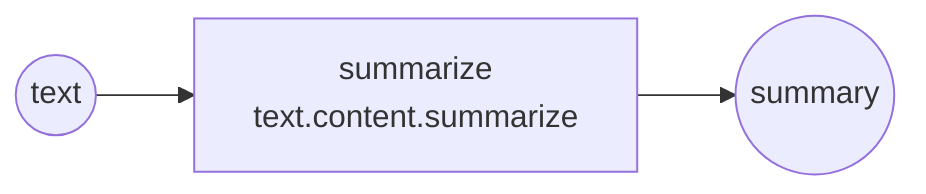

# Skill Authoring Guide

End-to-end reference for creating, testing, sharing, and maintaining skills
using the agent-skills CLI.

---

## Overview

The authoring workflow follows five stages:

```
Create → Test → Validate → Share → Maintain
```

| Stage | Commands |
|-------|----------|
| **Create** | `scaffold --wizard`, `scaffold "<intent>"` |
| **Test** | `test`, `check-wiring`, `describe --mermaid` |
| **Validate** | `validate` (schema + deep), `capabilities --input-type/--output-type` |
| **Share** | `export`, `import`, `contribute` |
| **Maintain** | `rate`, `report`, `discover --similar` |

---

## 1. Create a Skill

### Interactive wizard (recommended for beginners)

```bash
agent-skills scaffold --wizard
```

The wizard walks you through:
1. **Intent** — Describe what the skill should do in plain language.
2. **Channel** — Target channel: `local`, `experimental`, or `community`.
3. **Inputs/Outputs** — Define fields using `name:type` format.
4. **Capabilities** — Search and select from 122+ registered capabilities.

The wizard generates:
- `skill.yaml` — The complete skill definition.
- `test_input.json` — A test fixture with sensible defaults.
- Auto-validation against registered schemas.

### One-line scaffold

```bash
agent-skills scaffold "Summarize a PDF document and extract key points"
```

Options:
- `--channel experimental` — Target channel (default: `local`).
- `--model gpt-4o` — LLM model for generation (when `OPENAI_API_KEY` is set).
- `--dry-run` — Print the generated YAML without writing files.
- `--out-dir ./my-skills/` — Custom output directory.

### Manual creation

See [TUTORIAL_FIRST_SKILL.md](TUTORIAL_FIRST_SKILL.md) for the step-by-step manual
approach (capability → service → binding → skill YAML).

---

## 2. Test a Skill

### Run the test command

```bash
agent-skills test text.summarize
```

This:
1. Locates the skill YAML in local/experimental/community/official directories.
2. Looks for `test_input.json` next to the skill YAML.
3. Executes the skill and verifies all declared outputs are present.
4. Prints a structured report with status, timing, and output keys.

Options:
- `--input-file custom_input.json` — Use a custom test fixture.

### Check wiring compatibility

```bash
agent-skills check-wiring text.summarize
```

Validates that:
- Every step input references a variable produced by a prior step or skill input.
- Types match between source outputs and downstream inputs.
- No dangling references exist in the step DAG.

### Visualize the DAG

```bash
agent-skills describe text.summarize --mermaid
```

Outputs a Mermaid flowchart you can paste into GitHub, docs, or any Mermaid viewer:



---

## 3. Validate

### Two-phase validation

```bash
agent-skills validate text.summarize
```

**Phase 1 — Schema:** Validates the YAML against `docs/schemas/SkillSpec.schema.json`.
**Phase 2 — Deep:** Checks binding resolution, capability existence, and field coverage.

### VS Code inline validation

If you open the project in VS Code, skill YAML files get real-time validation
(red squiggles, autocomplete) via the YAML extension and the schemas in
`docs/schemas/`. The `.vscode/settings.json` maps `**/skill.yaml` files
to `SkillSpec.schema.json`.

### Filter capabilities by type

```bash
# Find capabilities that accept string input and produce array output
agent-skills capabilities --input-type string --output-type array
```

---

## 4. Share

### Export as a bundle

```bash
agent-skills export text.summarize
```

Creates a `.skill-bundle.tar.gz` containing:
- `skill.yaml`
- `test_input.json`
- `README.md` (auto-generated if not present)
- `bundle_manifest.json` (skill ID, version, capabilities used, timestamp)

### Import a bundle

```bash
agent-skills import text_summarize.skill-bundle.tar.gz
```

Extracts the bundle into your local skills directory and warns about
any missing capabilities.

### Contribute to the community

```bash
agent-skills contribute text.summarize
```

Runs a 4-step pipeline:
1. **Similar check** — Looks for existing skills that overlap.
2. **Prepare** — Generates the promotion package with admission template.
3. **Validate** — Runs full schema + deep validation.
4. **PR instructions** — Prints the git commands to submit a pull request.

---

## 5. Maintain

### Rate a skill

```bash
agent-skills rate text.summarize 5 --comment "Fast and accurate"
```

Stores ratings in `artifacts/skill_feedback.json` with Bayesian aggregates.
View ratings with `agent-skills describe text.summarize`.

### Report an issue

```bash
agent-skills report text.summarize "Output is empty when input exceeds 10KB" --severity high
```

Generates a GitHub issue template with structured sections and opens the
pre-filled URL in your browser.

### Find similar skills

```bash
agent-skills discover --similar text.summarize
```

Uses Jaccard similarity across capabilities, tags, and description words
to find the most related skills. Useful for avoiding duplicates or finding
skills to combine.

---

## Quick Reference

| Command | Purpose |
|---------|---------|
| `scaffold --wizard` | Interactive skill creation |
| `scaffold "<intent>"` | One-line skill generation |
| `test <id>` | Execute and verify a skill |
| `check-wiring <id>` | Validate step type compatibility |
| `describe <id> --mermaid` | DAG visualization |
| `validate <id>` | Schema + deep validation |
| `capabilities --input-type T` | Filter by field types |
| `export <id>` | Create portable bundle |
| `import <file>` | Import bundle into local skills |
| `contribute <id>` | Prepare + validate + PR pipeline |
| `rate <id> <1-5>` | Rate a skill locally |
| `report <id> "<text>"` | Generate issue template |
| `discover --similar <id>` | Find related skills |
| `ask "<question>"` | NL autopilot — discover, map, execute |
| `dev <id>` | Watch mode — hot-reload on change |
| `benchmark-lab <cap_id>` | Compare protocol bindings |
| `compose <file>` | Compile `.compose` DSL to skill YAML |
| `triggers list` | Show registered skill triggers |
| `triggers fire <type> ...` | Fire a trigger event manually |
| `showcase <id>` | Shareable markdown: diagram + example + benchmark |

---

## Local Capabilities & Extends

Capabilities are the stable contracts that skills consume. By default they come
from the registry (`agent-skill-registry/capabilities/`), but you can define
**local capabilities** and **extend** existing ones.

### Local capabilities

Place YAML files in `.agent-skills/capabilities/`:

```yaml
# .agent-skills/capabilities/my.org.custom.capability.yaml
id: my.org.custom.capability
version: 1.0.0
description: Organization-specific capability

inputs:
  payload:
    type: object
    required: true

outputs:
  result:
    type: string
```

The engine detects this directory automatically and gives local capabilities
**priority** over registry ones with the same id.

### Extending capabilities

Use `extends` to inherit a base contract and add fields:

```yaml
# .agent-skills/capabilities/local.text.summarize_v2.yaml
id: local.text.summarize_v2
version: 1.0.0
extends: text.content.summarize
description: Summarization with format control

inputs:
  format:
    type: string
    required: false

outputs:
  keywords:
    type: string
    required: false
```

**Rules:**

| Action | Allowed? |
|--------|----------|
| Add new inputs/outputs | ✅ Yes |
| Strengthen optional → required | ✅ Yes |
| Weaken required → optional | ❌ No |
| Multi-level chain (A → B → C) | ✅ Yes |
| Omit inputs/outputs (pure alias) | ✅ Yes — inherits all from base |

---

## Related Docs

- [Tutorial: First Skill](TUTORIAL_FIRST_SKILL.md) — Manual step-by-step approach
- [Binding Guide](BINDING_GUIDE.md) — How bindings work
- [Step Control Flow](STEP_CONTROL_FLOW.md) — DAG dependencies, conditions, retries
- [CognitiveState v1](COGNITIVE_STATE_V1.md) — Structured reasoning state
